  <picture>
    <source media="(max-width: 760px) and (prefers-color-scheme: dark)" srcset="./assets/hero/builder-profile-v2-mobile-dark.svg">
    <source media="(max-width: 760px)" srcset="./assets/hero/builder-profile-v2-mobile-light.svg">
    <source media="(prefers-color-scheme: dark)" srcset="./assets/hero/builder-profile-v2-dark.svg">
    <source media="(prefers-color-scheme: light)" srcset="./assets/hero/builder-profile-v2-light.svg">
    
  </picture>

  <a href="https://www.linkedin.com/in/bhargavraviteja/"><strong>LinkedIn Profile</strong></a> · <a href="https://flixport08.vercel.app"><strong>Portfolio</strong></a>

## Hello, I'm Bhargav

I'm **A P Bhargav Ravi Teja**, an AI/ML enthusiast with a B.Tech in Computer Science (AI/ML specialization). I build machine-learning, generative-AI, and full-stack applications, with a current interest in agentic systems using LangChain, RAG, and LLMs.

## Focus Areas

- **Machine learning & computer vision:** TensorFlow, Scikit-learn, OpenCV, NLP, and data analysis.
- **Generative AI & LLMs:** RAG, fine-tuning, evaluation, and prompt engineering.
- **Backend & web:** FastAPI, Express.js, REST APIs, HTML, CSS, and JavaScript.

## Selected Work

| Project | What it does | Stack |
| --- | --- | --- |
| [**Stine Bot**](https://github.com/Bhargav200/-Intelligent-Slack-Knowledge-Base_BhargavRaviTeja) | Slack-native AI knowledge base with hybrid search, citations, and multi-turn memory. | Python · FastAPI · React · RAG · SQLite |
| [**Know-AI**](https://github.com/Bhargav200/Know-AI) | Web research assistant that searches, extracts content, and produces AI-powered summaries. | Python · FastAPI · Docker |
| [**Flixport08**](https://github.com/Bhargav200/Flixport08) · [Live](https://flixport08.vercel.app) | TypeScript web application. | TypeScript · JavaScript · CSS |
| [**StudyOrbit**](https://github.com/Bhargav200/LMS-Edutech-Hackathon--StudyOrbit-) · [Live](https://studyorbit-lms.vercel.app) | Learning-management web application. | TypeScript · CSS · JavaScript |
| [**Clipnova**](https://github.com/Bhargav200/clipnova-ai-editor) | AI editor application. | TypeScript · PostgreSQL |

## Experience & Education

- **AIML Associate, Devtern** — built ML and LLM-powered applications, including RAG systems and FastAPI backends (May 2023–Mar 2024).
- **Full Stack Intern, Webstack Academy** — developed full-stack applications and REST APIs (Aug 2023–May 2024).
- **Web Development Intern, Oasis Infobyte** — built responsive web applications with HTML, CSS, JavaScript, and React (Apr 2023–May 2023).
- **B.Tech, Computer Science (AI/ML), Siddhartha Institute of Engineering and Technology** — 2020–2024.

## Tools I Use

`Python` · `C++` · `JavaScript` · `HTML` · `CSS` · `FastAPI` · `Express.js` · `TensorFlow` · `Scikit-learn` · `OpenCV` · `RAG` · `LangChain` · `Git` · `Jupyter` · `Kubernetes (basics)`

## Certifications

Multi AI Agents with CrewAI · IoT Certification (Coursera) · Google Cybersecurity Certification

## Contribution Trail

  <picture>
    <source media="(prefers-color-scheme: dark)" srcset="https://raw.githubusercontent.com/Bhargav200/Readme/output/github-contribution-grid-snake-dark.svg">
    <source media="(prefers-color-scheme: light)" srcset="https://raw.githubusercontent.com/Bhargav200/Readme/output/github-contribution-grid-snake.svg">
    
  </picture>

<strong>Recent public activity</strong>

 

<!-- AUTO:ACTIVITY:START -->
- Sep 9, 2026: pushed 1 commit to [Bhargav200/Readme](https://github.com/Bhargav200/Readme).
<!-- AUTO:ACTIVITY:END -->

---

Building practical AI/ML, generative-AI, and full-stack systems.

